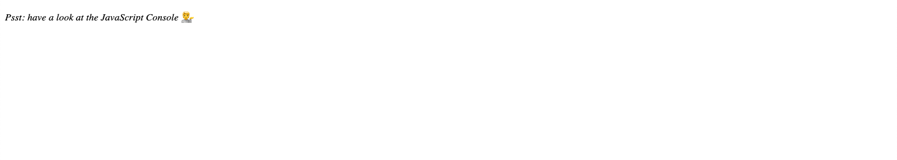
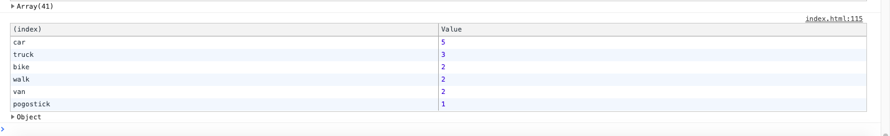
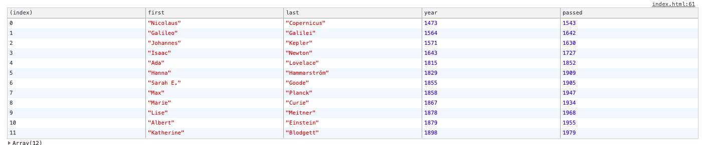

# array-cardio-one

## Description
This is challenge four from JS30 working with the fundamentals of array methods which include sort, filter, map, and reduce.

## Installation

1. Clone the repo
2. Right click the index.html file and open in browser

## Usage
[Deployed Site](https://sharonkim09.github.io/array-cardio-one/)

## Credit

Credits to [Wes Bos](https://github.com/wesbos) JS 30Day Challenge

